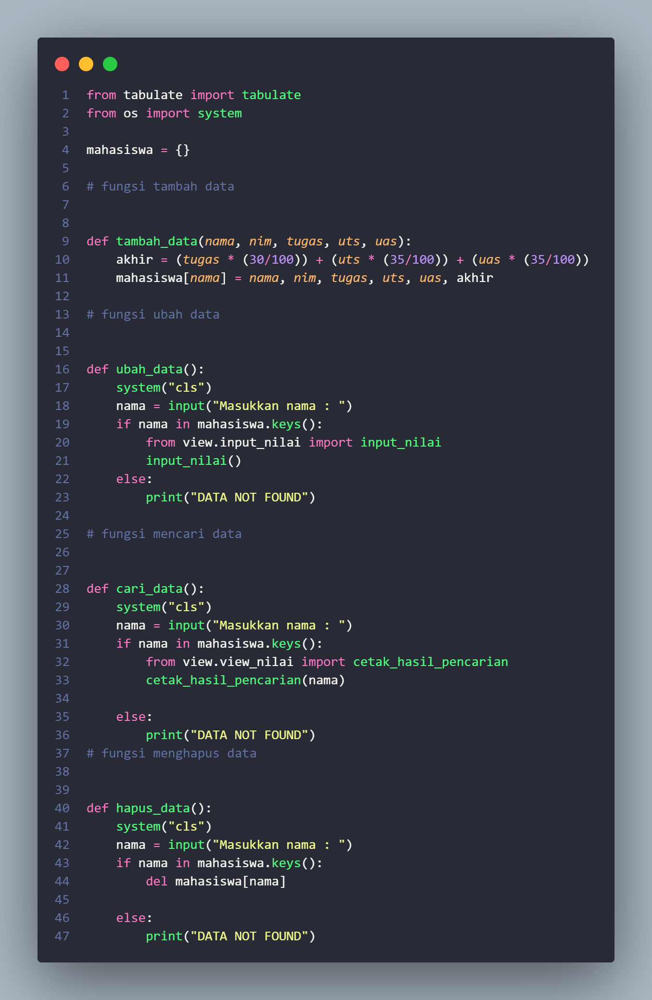
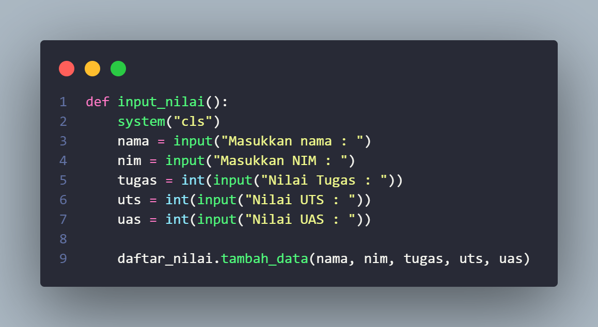
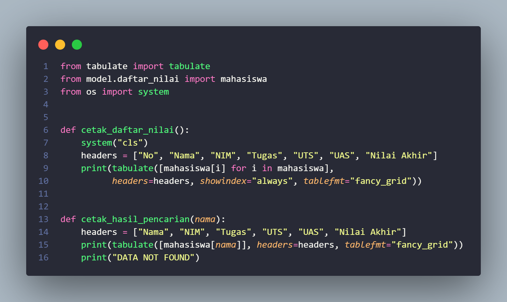
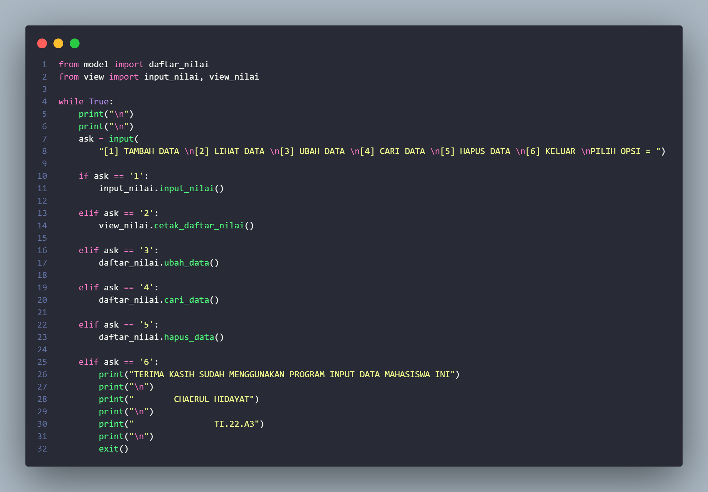
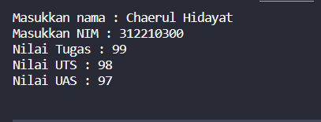
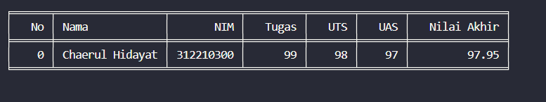
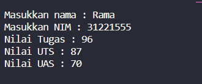
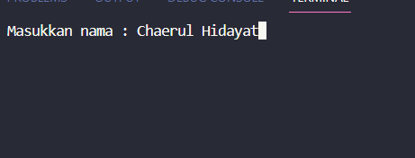
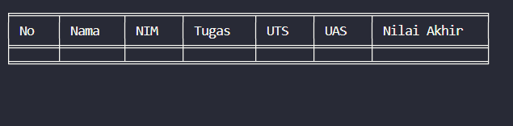
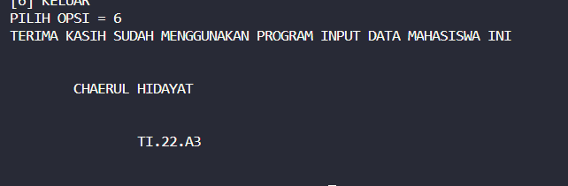

# Project UAS Bahasa Pemograman
  
NAMA  : Chaerul Hidayat 
Kelas : T.I.22.A.3 
NIM   : 312210300 
LINK Youtube : [https://www.youtube.com/watch?v=uQywLmp2x9U](https://www.youtube.com/watch?v=uQywLmp2x9U)

Disini Saya akan Menjelaskan Kode Daftar NIlai 
 
Kode daftar_nilai berisi: tambah_data, ubah_data, cari_data, hapus_data.  
~ tambah_data  
tambah_data berguna untuk menambahkan data seperti nama, nim,
nilai tugas, nilai UTS, nilai UAS, nilai akhir. tambah data yang di input  user   
➢ ubah_data 
ubah_data berguna untuk mengubah data-data yang di input user dan ingin di ubah   
➢ cari_data 
cari_data berguna untuk menampilkan data yang dicari dalam input, cari data yang di input oleh user sebelum nya   
➢ hapus_data 
hapus_data berguna menghapus data yang diinput oleh user , biasa nya user ingin menghapus data yg salah  

~Kode input nilai
  
Kode input nilai ini berfungsi untuk menginput inputan user yang memasukan nama,nim,tugas,uts,uas   

~Kode View Nilai 
 
Kode View Nilai berisi Fungsi [cetak_daftar_nilai ]()dan [cetak_hasil_pencarian]() nama yang di cari oleh user akan menampilkan daftar nilai yang rapih dengan tabel
karna saya menggunakan liblary tabulate, sedangkan cetak_hasil_pencarian akan menampilan nama yang di carin oleh user hanya dengan menginput nama yg di input   

~Kode Main Py  
 
 kode [main.py]() ini ada program utama untuk menjalankan input data Mahasiswa disini bisa Menmabah Data , Melihat Data , Menghapus Data , Mengubah Data , Dan Mencari Data   

  

[#Output Tambah Data]()
   
[#Output Lihat Data]()
   
[#Output Ubah Data]() 
Data Sebelum Di Ubah  
 
Data Setelah Di ubah  
 
Dan Ini Hasil Ubah Data nya  
[#Output Hapus Data ]() 
Data Sebelum Di Hapus  
 
Data Setelah Di Hapus  
 
#Output Keluar Menu  
  

SEKIAN TERIMA KASIH

